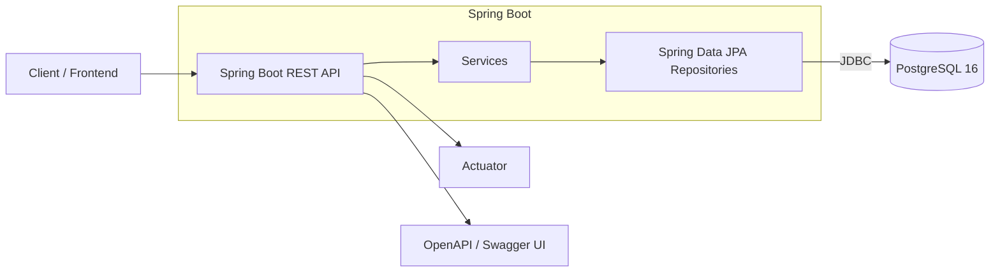

# Evently Backend — Architecture & Features

This document summarizes the system we implemented, concepts used, and how to test endpoints.

## Tech stack

- Spring Boot 3.3 (Web, Validation, JPA, Actuator)
- PostgreSQL 16 via JDBC + Flyway migrations
- Hibernate ORM with optimistic locking
- springdoc-openapi (Swagger UI)
- Lombok

## Core domain

- User (table `app_user`) with roles ADMIN/USER.
- Event (table `event`), fields: name, venue, startsAt, capacity, bookedCount, `@Version` for optimistic locking.
- Seat (optional seat-level booking), status AVAILABLE/BOOKED.
- Booking (table `booking`), links user+event(+seat), status CONFIRMED/CANCELED.
- Waitlist (table `waitlist`) for full events.

## Concurrency & integrity

- Optimistic locking on Event via `@Version`. `BookingService` retries on `OptimisticLockException` (3 attempts with jitter).
- Capacity enforced in service: check remaining = capacity - bookedCount; when full, the user is added to waitlist.
- Unique constraints prevent duplicate same user+event+seat booking.
- Seat booking validates seat belongs to event and is AVAILABLE; state is updated accordingly.

## Persistence and migrations

- Flyway manages schema: baseline (V1) + core schema (V2). Triggers maintain `updated_at` timestamps.
- JPA `ddl-auto=validate` ensures schema matches entities.

## Services and controllers

- EventService/EventController: list, create, update.
- BookingService/BookingController: book, cancel, list by user.
- UserService/UserController: list, create (idempotent by email).
- AnalyticsService/AnalyticsController: overview and top events.
- HealthController: `/health`.

## Error handling

Central `ApiExceptionHandler` maps:

- 400: IllegalArgumentException, validation errors.
- 404: EntityNotFoundException.
- 409: OptimisticLockException, DataIntegrityViolationException.

## DTOs

- EventDto, CreateEventRequest, UpdateEventRequest.
- CreateUserRequest, UserResponse.
- BookingRequest, BookingDto (prevents lazy-loading serialization issues).
- AnalyticsOverview, EventStat.

## Seeding

`DataSeeder` creates:

- Users: admin@evently.local (ADMIN), user@evently.local (USER)
- Sample event if none exist.

## Testing endpoints (examples)

Assumes app on http://localhost:8080.

1. Health

- GET /health → { status: "UP" }

2. Users

- GET /api/users
- POST /api/users { email, name, role? }

3. Events

- GET /api/events
- POST /api/events { name, venue, startsAt, capacity }
- PUT /api/events/{id} { name?, venue?, startsAt?, capacity?, version }

4. Bookings

- POST /api/bookings { userId, eventId, seatId? } → BookingDto
- POST /api/bookings/{id}/cancel → BookingDto
- GET /api/bookings/user/{userId} → [BookingDto]

5. Analytics

- GET /api/analytics/overview → totals + avg utilization
- GET /api/analytics/top-events?limit=N → top events by bookedCount

## Dev workflow

- Use `mvn -DskipTests spring-boot:run` for fast reloads (devtools enabled).
- Swagger UI: `/swagger-ui/index.html`.

### Docker & Compose

- Build and run app only:

  - `docker build -t evently-backend .`
  - `docker run --rm -p 8080:8080 --env SPRING_DATASOURCE_URL=jdbc:postgresql://host.docker.internal:5433/evently --env SPRING_DATASOURCE_USERNAME=evently_user --env SPRING_DATASOURCE_PASSWORD="ChangeMe_Strong_#2025" evently-backend`

- Bring up full stack (DB + app):
  - `docker compose up -d --build`
  - App: http://localhost:8080
  - DB: postgres on localhost:5433 (mapped from container 5432)

## Next steps

- Implement waitlist promotion on cancel (seat hold + notification hooks).
- Seat-hold timeouts and pessimistic locking for seat rows if needed.
- Add integration tests and load-testing notes.
- Dockerfile + docker-compose and deployment docs.

---

## Detailed design and trade-offs

### High-level architecture



Rationale:

- Stateless API enables horizontal scaling (multiple app instances behind a load balancer).
- JPA abstracts persistence; Flyway manages deterministic schema evolution.
- Actuator and OpenAPI improve operability and API discoverability.

### ER model

```mermaid
erDiagram
	APP_USER ||--o{ BOOKING : makes
	EVENT ||--o{ BOOKING : has
	EVENT ||--o{ SEAT : contains
	APP_USER ||--o{ WAITLIST : joins
	EVENT ||--o{ WAITLIST : for

	APP_USER {
		bigint id PK
		string email
		string name
		enum role
		timestamptz created_at
		timestamptz updated_at
	}

	EVENT {
		bigint id PK
		string name
		string venue
		timestamptz starts_at
		int capacity
		int booked_count
		bigint version // optimistic locking
		timestamptz created_at
		timestamptz updated_at
	}

	SEAT {
		bigint id PK
		bigint event_id FK
		string label
		enum status
	}

	BOOKING {
		bigint id PK
		bigint user_id FK
		bigint event_id FK
		bigint seat_id FK nullable
		enum status
		timestamptz created_at
		timestamptz updated_at
		unique (user_id, event_id, seat_id)
	}

	WAITLIST {
		bigint id PK
		bigint user_id FK
		bigint event_id FK
		int position
		unique (user_id, event_id)
	}
```

### Concurrency strategy (bookings under load)

- Technique: optimistic locking on `Event` with `@Version`. Each booking:
  1.  Read event and compute remaining = capacity - bookedCount.
  2.  If none left: enqueue to waitlist and return 400 with a message.
  3.  If seatId is specified: validate seat belongs to event and is AVAILABLE, then mark BOOKED.
  4.  Increment event.bookedCount and save. If another transaction modified the row, Hibernate throws `OptimisticLockException`.
  5.  On `OptimisticLockException`, retry up to 3 times with small jitter; reload fresh state each attempt.

Why optimistic, not pessimistic?

- Most bookings succeed without contention on the same row. Optimistic avoids DB-level locks and scales better. We only retry on the rare conflict.

When to consider pessimistic locking?

- Seat-level booking with high contention on few seats may use `SELECT ... FOR UPDATE` on `seat` rows to avoid double-assigning the same seat. This can be added per-seat without locking the `event` row.

Integrity guardrails:

- Unique constraint on `(user_id, event_id, seat_id)` prevents duplicate identical bookings under race.
- Cancellation is idempotent: repeated cancels return the already-canceled booking.
- Exception mapping: 409 for integrity/optimistic conflicts, 404 for missing entities, 400 for invalid input.

Edge cases handled:

- Multiple concurrent booking attempts beyond capacity → only up to capacity succeed; others are waitlisted.
- Cancel after seat booking: seat returned to AVAILABLE; `bookedCount` decremented (floored at 0).
- Booking without seats (general admission) supported; seatId optional.

### Transactions and isolation

- Service methods are `@Transactional` so the read-check-increment-save executes atomically per attempt.
- Default isolation in PostgreSQL (read committed) is acceptable with optimistic version checks. For stricter semantics on seats, use row locks.

### Scalability considerations

- Stateless services → can scale out with more app instances.
- HikariCP tuned by default; can raise pool size under heavy load.
- Indexes on `booking(user_id)`, `booking(event_id)`, `event(starts_at)`, `waitlist(event_id, position)` to speed queries.
- Caching candidates: event list and event details (read-heavy), backed by TTL cache or Redis (future work).
- Read replicas: Analytics can read from replicas to reduce load on primary.
- Sharding: Partition bookings by event_id if a single event becomes extremely hot.
- Backpressure: rate-limit booking endpoint per user/IP; enqueue excess into a queue (e.g., Kafka) for smoother handling at extreme spikes.

### API and error handling

- RESTful endpoints with proper status codes.
- Validation via `jakarta.validation` annotations; errors mapped to 400.
- Central `ApiExceptionHandler` ensures consistent JSON error payloads.

### Analytics

- Overview aggregates: total users/events, confirmed bookings (sum of bookedCount), average utilization across events with capacity>0.
- Top events: sort by bookedCount; returns utilization per event.
- Future: daily timeseries, cancellation rates, cohort analyses; move heavy queries to materialized views or background jobs.

### Testing strategy

- Unit tests for services (mock repos) and concurrency retry logic.
- Integration tests with Testcontainers PostgreSQL to validate migrations and transactional behavior.
- Load testing plan: k6/JMeter scenarios to simulate concurrent bookings; verify no overselling and success/failure distributions.

### Security (to add)

- Add auth (JWT or session) with roles ADMIN/USER to protect admin endpoints.
- Input hardening and rate-limiting for booking endpoints.

### Deployment (to add)

- Dockerfile and docker-compose for app+Postgres.
- Deploy to Render/Railway; externalize DB URL/creds; run Flyway on startup.

---

## Gaps vs. requirements

- Deployment to a hosted platform: pending.
- Dockerfile and docker-compose: pending.
- Diagrams: provided (Mermaid) but can export PNGs if required.
- Waitlist promotion flow (auto-promotion, notifications): partial (enqueuing only).
- Seat-hold timeouts and pessimistic seat locking: not yet implemented.
- Advanced analytics (cancellation rates, daily stats): pending.
- Comprehensive tests (unit/integration/load): pending.
- Authentication/authorization: pending.

## Proposed next steps

1. Delivery basics

   - Add Dockerfile and docker-compose (app + Postgres), env overrides, and README run guide.
   - Deploy to Render/Railway and note the base URL.

2. Functional hardening

   - Implement waitlist promotion on cancel (promote first in line, send notification hook) with transactional safety.
   - Optional: seat hold with expiry (pessimistic lock seat, hold window using a scheduled task or redis TTL).

3. Analytics

   - Add endpoints: daily booking counts, cancellation rates, event popularity trends.

4. Quality
   - Add Testcontainers-based integration tests, plus a couple of load-test scripts (k6).
   - Add auth (JWT) and role-guard admin endpoints.
