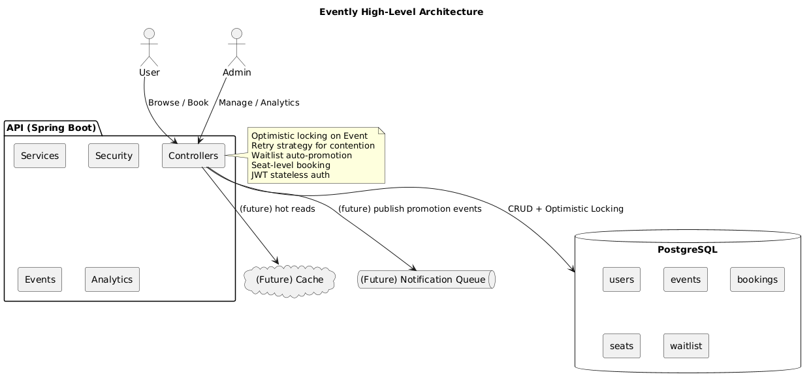
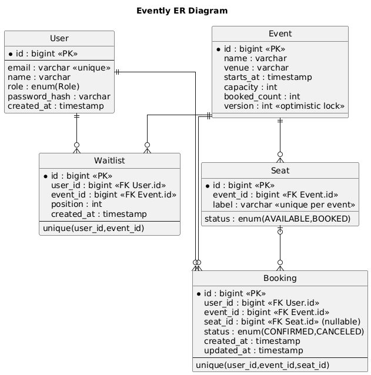

# Evently — Scalable Event Booking Backend

Production-grade Spring Boot backend for browsing events, secure ticket booking with concurrency safety, waitlists, seat selection, and organizer analytics.

- Live API: https://evently-backend-ph3i.onrender.com/swagger-ui/index.html#/

- Video Tutorial: https://youtu.be/mAG2Jp98pHg?si=LE6GExTJR_t5_fm0
  
## At a Glance

## What’s Inside

- Users: signup/login (JWT), browse events, book & cancel, view bookings
- Admins: manage events, generate seats, view analytics
- Concurrency-safe booking: optimistic locking + retry loop (no oversell)
- Waitlist with auto-promotion on cancellation
- Optional seat-level selection
- Analytics: overview, top events, daily confirmed, cancellation rate
- Security: stateless JWT (HS256), role-based access
- Schema migrations with Flyway

## Use the Deployed API

Start at Swagger and try endpoints in your browser:

1. Open Swagger UI

- https://evently-backend-ph3i.onrender.com/swagger-ui/index.html#/

2. Sign up a user

- POST /api/auth/signup (email, name, password)

3. Log in

- POST /api/auth/login → copy the token value
- Click “Authorize” in Swagger → paste `Bearer <token>`

4. Browse events

- GET /api/events

5. Book a ticket

- POST /api/bookings → body: { "eventId": <id>, "seatId": optional }

6. View your bookings

- GET /api/bookings/me

7. Cancel

- POST /api/bookings/{bookingId}/cancel

8. Admin-only features

- Use the seeded admin (email: admin@evently.local, password: admin123) to get an admin token
- Create/update events: POST/PUT /api/events
- Generate seats: POST /api/seats/generate
- Analytics: /api/analytics/\* (overview, top-events, daily-confirmed, cancellation-rate)

Note: Admin-only endpoints are strictly protected; non-admin tokens cannot use them.

## How It Works (Design Summary)

- Concurrency: Optimistic locking on Event (version field) prevents oversell; retry on contention.
- Integrity: Unique constraints (booking and waitlist) prevent duplicates.
- Security: JWT auth, role-based access; CORS configurable.
- Performance: Indexes for hot paths; analytics via repository queries.
- Extensibility: Seat-level booking implemented; hooks ready for notifications/holds.

## Local Setup

Prerequisites: Java 17+, Maven, PostgreSQL 16 (or Docker)

Option A — Local Postgres

1. Create DB and user:
   - DB: evently User: evently*user Password: ChangeMe_Strong*#2025
2. Environment (PowerShell):
   - $env:SPRING_DATASOURCE_URL="jdbc:postgresql://localhost:5432/evently"
   - $env:SPRING_DATASOURCE_USERNAME="evently_user"
   - $env:SPRING*DATASOURCE_PASSWORD="ChangeMe_Strong*#2025"
   - $env:APP_JWT_SECRET="<Base64-48+ bytes>"
3. Run: mvn spring-boot:run
4. Swagger: http://localhost:8080/swagger-ui/index.html

Option B — Docker Compose

1. cd docker
2. docker compose up --build
3. App: http://localhost:8080 DB: localhost:5432

Seeded users:

- admin@evently.local / admin123 (ADMIN)
- user@evently.local / user123 (USER)

## Testing

Run tests: mvn test

## Deployment (Production)

Deployable on services like Render or Railway using the included Dockerfile.

Environment variables required by the app:

- SPRING_DATASOURCE_URL, SPRING_DATASOURCE_USERNAME, SPRING_DATASOURCE_PASSWORD
- APP_JWT_SECRET (Base64 256-bit recommended)
- APP_CORS_ORIGINS (e.g., \* or your frontend origins)
- SPRING_PROFILES_ACTIVE=prod

Verify after deploy:

- /actuator/health returns UP
- Swagger UI loads and authenticated endpoints work

---

See task.md for full specification and evaluation criteria.
